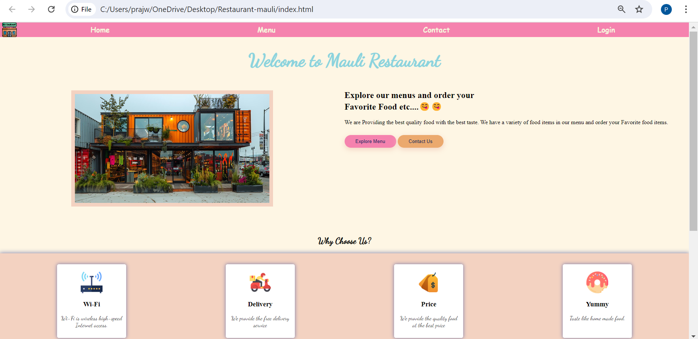
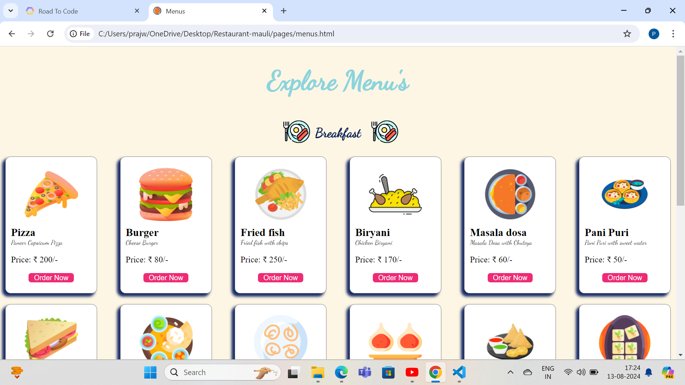
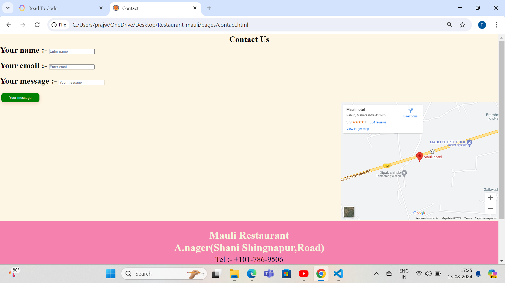
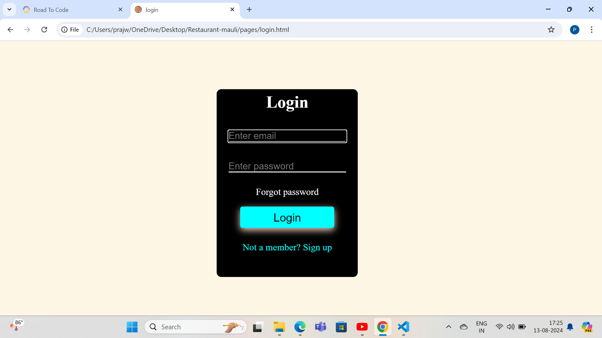

#  Project title :- Mauli Restaurant  👌😎

 !! Welcome To Mauli Restaurant in Shani Shingnapur...!!
 Hi and a huge welcome from Team [ Mauli Restaurant]! We're thrilled to have you with us. Get ready for a memorable time and a great experience. We're just a message away if you need anything..❤️‍🩹

 ### we have Follow pages in our website :- 👇

 - Home
 - Menus
 - contact
 - login
  
## Home page :-

# Information menus page :-
- Menus page :- Remember that hungry customers are looking for menu items that sound delicious and will satisfy their cravings..😋😋

# menus page

# contact page 

# Basic Information of contact page :-
- A strong Contact Us page should contain several elements, such as a phone number and links to social media channels. It should also be easy to navigate, as this makes for a positive customer experience..😊🛂

# login page

# login information :-
- Login Information means a user name and password, a password, or other means of authentication that protects access to a personal social networking account..👈

## Goals 
- Create a visually appealing and easy-to-navigate website.
- Showcase the restaurant's menu and services .

## Technologies used
- HTML 5 & css

## Message for customer 

- This wedsite highlight the restaurant main features and goal of the restaurant .The website aims to provide an engaging and user-friendly experience for customers to explore and learn about the restaurant..🙏😊

  Thanks for visiting Mauli Restaurant...🙏😘  🙏🙏